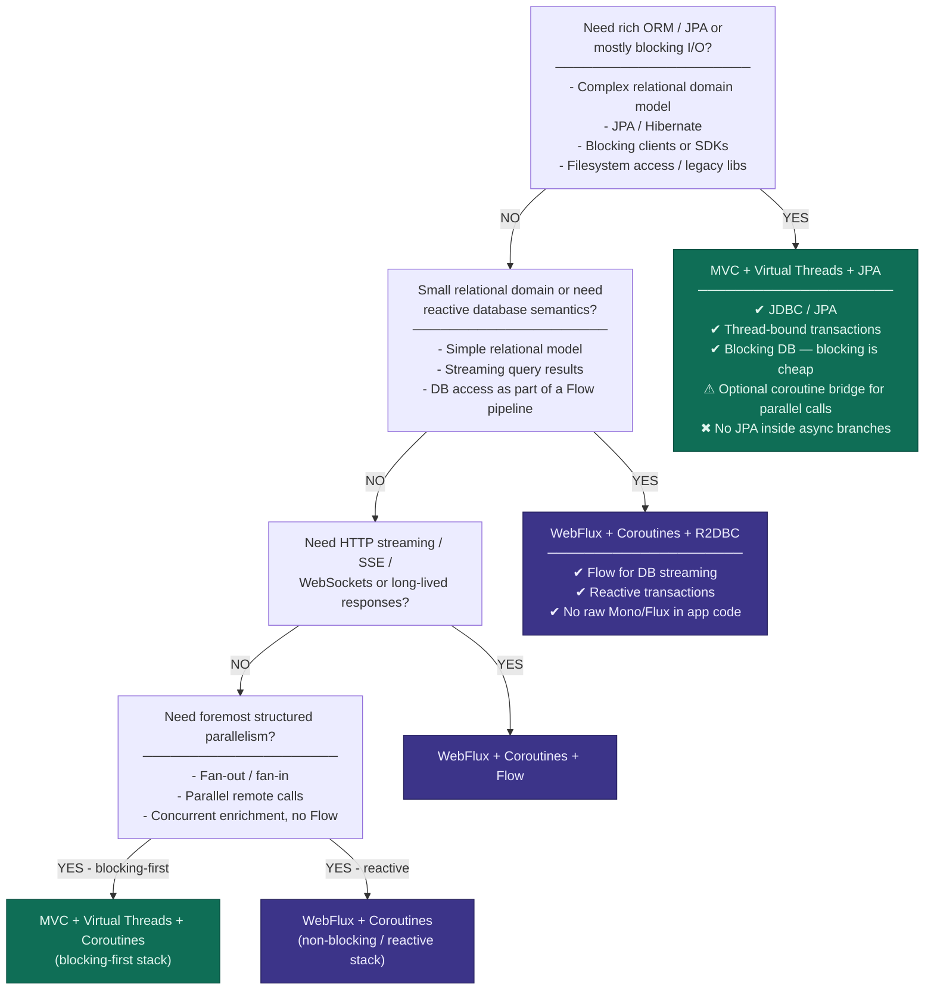

# KotlinConf2026

## Workshop
### Spring Boot With Coroutines and Virtual Threads

* [Summary](workshop/COURSE_SUMMARY.md)
* [Slides](workshop/Reactive%20Spring%20Boot%20With%20Coroutines%20and%20Virtual%20Threads%20-%20KotlinConf%202026.pdf)
* [Sources](workshop/kotlin-training-labs.zip)

*Decision Tree: When to use which Spring Boot Stack*

## Sessions

### Opening Keynote

### Bootiful Kotlin
Speaker: _Josh Long_ - Spring Developer Advocate

Spring Boot marries Spring's flexibility with conventional, common sense defaults to make application development on the JVM not just fly, but pleasant!

The framework is as clean as it gets, wouldn't it be nice if the language with which you wielded it matched its elegance?

Kotlin, the productivity-focused language from our friends at JetBrains, takes up the productivity slack to make the experience leaner, cleaner and even more pleasant.

The Spring and Kotlin teams have worked hard to make sure that Kotlin and Spring Boot are a first-class experience for all developers trying to get to production, faster and safer.

Come for the Spring and stay for the Bootiful Kotlin.

### Concurrency Patterns for Modern High Performance Kotlin Servers
Speaker: _Bowen Feng_ - Software Engineer @Google

Kotlin coroutines give us powerful tools for asynchronous server programming, but using them well requires more than knowing launch, async, or Flow in isolation. High-performance servers are built from recurring concurrency patterns: small, composable ways to structure work, stream results, isolate slow dependencies, and control producer-consumer boundaries.

In this session, we will explore several useful concurrency patterns by building a simplified AI assistant server live. We will break complex server behavior into distinct concurrency challenges and show how Kotlin’s async primitives provide elegant, structured answers: generator-style flows for more responsive event streams, fan-in for concurrent execution, sequence numbers for handling out-of-order responses, coarse and fine-grained timeouts for reliability, request hedging to improve tail latency, and backpressure and buffering for slow clients.

The demo is intentionally small, but it mirrors real server-side problems: many independent async operations, variable dependency latency, partial responses, cancellation, and streaming output. By the end, you will have a practical mental model for composing coroutines, structured concurrency, channels, and Flow into clear, reusable concurrency building blocks for Kotlin servers.
