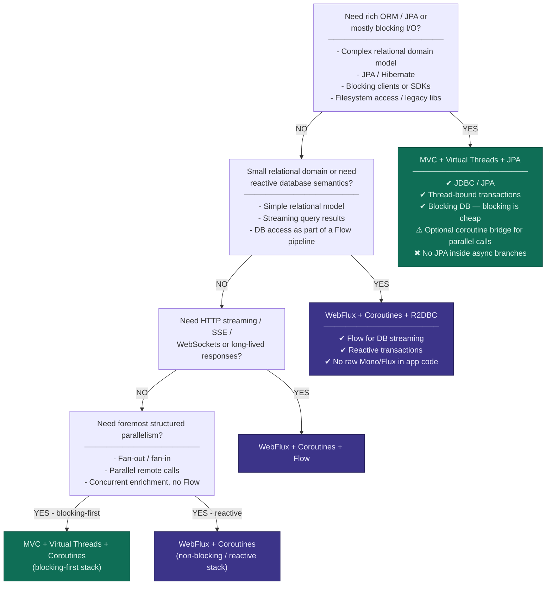

# KotlinConf2026

## Workshop
### Spring Boot With Coroutines and Virtual Threads

* [Summary](workshop/COURSE_SUMMARY.md)
* [Slides](workshop/Reactive%20Spring%20Boot%20With%20Coroutines%20and%20Virtual%20Threads%20-%20KotlinConf%202026.pdf)
* [Sources](workshop/kotlin-training-labs.zip)

*Decision Tree: When to use which Spring Boot Stack*

## Sessions

### Opening Keynote

### Bootiful Kotlin
Speaker: _Josh Long_ - Spring Developer Advocate

Spring Boot marries Spring's flexibility with conventional, common sense defaults to make application development on the JVM not just fly, but pleasant!

The framework is as clean as it gets, wouldn't it be nice if the language with which you wielded it matched its elegance?

Kotlin, the productivity-focused language from our friends at JetBrains, takes up the productivity slack to make the experience leaner, cleaner and even more pleasant.

The Spring and Kotlin teams have worked hard to make sure that Kotlin and Spring Boot are a first-class experience for all developers trying to get to production, faster and safer.

Come for the Spring and stay for the Bootiful Kotlin.

### Concurrency Patterns for Modern High Performance Kotlin Servers
Speaker: _Bowen Feng_ - Software Engineer @Google

Kotlin coroutines give us powerful tools for asynchronous server programming, but using them well requires more than knowing launch, async, or Flow in isolation. High-performance servers are built from recurring concurrency patterns: small, composable ways to structure work, stream results, isolate slow dependencies, and control producer-consumer boundaries.

In this session, we will explore several useful concurrency patterns by building a simplified AI assistant server live. We will break complex server behavior into distinct concurrency challenges and show how Kotlin’s async primitives provide elegant, structured answers: generator-style flows for more responsive event streams, fan-in for concurrent execution, sequence numbers for handling out-of-order responses, coarse and fine-grained timeouts for reliability, request hedging to improve tail latency, and backpressure and buffering for slow clients.

The demo is intentionally small, but it mirrors real server-side problems: many independent async operations, variable dependency latency, partial responses, cancellation, and streaming output. By the end, you will have a practical mental model for composing coroutines, structured concurrency, channels, and Flow into clear, reusable concurrency building blocks for Kotlin servers.

### Why Most AI Agents Never Scale? Building Enterprise-Ready AI with Koog
Speaker: _Vadim Briliantov_ - JetBrains, Koog, Technical Lead

AI agents are everywhere — but most of them break the moment you try to use them for anything real. Token costs explode, behavior becomes unpredictable, and primitive “LLM + loop” architectures simply don’t scale beyond flashy demos.

At JetBrains, we’ve been building agents that power real products used by millions. Koog is the open-source Kotlin and JVM framework that came out of this experience and was released at the KotlinConf 2025 exactly 1 year ago. In this talk, we’ll introduce Koog 1.0.0-RC and show how its design makes AI agents scalable, predictable, and ready for production.

Koog gives Kotlin and Java teams a complete toolset for building agents as well-structured, type-safe systems — whether you’re using simple functional agents, graph strategies, or planning-based approaches. It integrates deeply with the JVM and Kotlin Multiplatform ecosystems, including Spring, Spring AI, Ktor, Langfuse, W&B Weave, AWS Agent Core, Google Agent Engine, and full support for Android and Gemma-based local agents.

We’ll also look at how Koog handles challenges that most agent frameworks avoid:

* Managing cost and context at scale through strategy-driven decomposition.
* Modeling domain behavior using strongly-typed steps, so agents produce reliable, controlled outputs instead of guesswork.
* Persisting and checkpointing agent state for fault recovery and long-running workflows.
* Observing, evaluating, and improving agents with OpenTelemetry, Langfuse, and W&B Weave.
* By the end, you’ll understand why most AI agents don’t scale and how Koog helps you build the ones that do: agents that run across JVM and KMP targets, integrate cleanly with existing systems, and remain robust under real-world load.

If you want to bring AI agents into production without rewriting your stack or sacrificing reliability, this talk is for you.

### The Lord of Collection Functions - The Fellowship of Kotlin

Speaker: _Ben Kadel_- Android / Mobile Platform Engineer

A darkness has awoken in Center-earth, an ancient evil is reaching out of the shadows of every corrupt codebase, intent on bringing destruction & algorithmic oppression to all that call this world home. Everything that once was cherished will be lost, if the growing scourge is not defeated & cast back into the fires from whence it came…

That my dear friends, is where you come in…

Join the Kotlin fellowship on an exciting journey to save Center-earth from the imperative evil that was thought long extinct, but is now looping back once more! Help restore pure functional programming to this peaceful realm, ensure immutability & defeat the evil Dark Lord For-ron.

Together, we will explore the expansive array of Kotlin Collection Functions; these allow us to perform useful tasks on collections, like Set, Map, & List. Enabling us to transform, check, analyse, & aggregate the contents of the collection. We will unlock their secrets—understanding where to wield them, and how to apply their power for maximum effect, including (but not limited to):

filter, map & partition.

flatMap, zip & groupBy.

associateWith, windowed & runningFold.

### Dissecting Kotlin: 2026
Speaker: _Huyen Tue Dao_ - Software Engineer @ Netflix | Co-host @ Android Faithful

Kotlin 1.0 launched 10 years ago, and the language continues to rapidly evolve. As developers, whether we use 1.0 features or explore previews, our Kotlin knowledge grows through both experience and study of its features, design, and implementation.

In this talk, we will explore recent stable and in-preview Kotlin features, review their design and implementation, and consider what they reveal about Kotlin as a language and how they can inspire our everyday Kotlin.

### Idiomatic Kotlin applications with Spring Boot 4
Speaker: _Sébastien Deleuze_ - Spring Framework core committer

In this brand new talk, Sébastien shares his guidance on how to write idiomatic Kotlin applications in 2026 with Spring Boot by focusing on various aspects: build, null-safe APIs, logging, configuration, serialization, observability, API versioning, resilience, efficiency, tests, persistence, AI, etc.

He will leverage the latest Kotlin extensions and Spring Boot 4 features in multiple short examples and demos to share tips and recipes that should be easily actionable for Kotlin server-side developers.

### Eval-Driven Development: The Fine Line Between Agentic Success and Failure
Speaker: _Urs Peter_ - Senior Software Engineer and JetBrains certified Kotlin Trainer

Agentic systems unlock capabilities that traditional “deterministic” applications simply can’t deliver. But there’s a catch: their probabilistic nature introduces real and often unexpected risks—hallucinations, context drift, prompt degradation, and multi-step workflows that evolve in surprising ways. And you definitely don’t want to discover those in production.

The good news: there is a remedy. We can borrow the most reliable practice from deterministic software—test-driven development—and adapt it to the agentic world. The result is Eval-Driven Development (EDD): a systematic, engineering-first approach to bringing reliability into inherently probabilistic systems.

In this talk, we explore Eval-Driven Agentic Development and how it can transform your agents from unpredictable to reliable. We’ll dive into the techniques, tools, and patterns needed to make evaluation a first-class citizen of your development process—demonstrating all of these in a real-world application built with the powerful AI framework: Koog.

Along the way, you will learn how to:
* Test agents at multiple layers—schema validation, tool correctness, decision flows, and end-to-end goal completion
* Gather metrics that serve as the backbone of meaningful evaluations
* Turn complex agent traces into actionable insight rather than noise
* Use LLMs to generate test cases, assertions, synthetic data, and act as “judges” in your eval pipeline
* Detect regressions when prompts, models, or data change
* Build a continuous evaluation loop with real-world data—so your agents improve over time instead of quietly degrading

Evaluation-Driven Development is the only path forward for reliable, smart next-generation applications. Let's learn how to walk it - together!

### Flow with Exposed: Life Finds a Way
Speaker: _Chantal Loncle_ - Software Developer, JetBrains

A single automaton is activated. The ruleset for its potential state is predetermined. How many generations will it or its descendants take to breach the confines of their environment? What if hundreds had been activated?

Using a zero-player simulation with each automaton signalling its own state-change event to the server, we'll see how Exposed, a database access library, can assist with high throughput and the handling of asynchronous database operations. We'll also leverage Kotlin Flow on top of Exposed DSL queries to observe a continuous data stream of all state updates to the UI.

Throughout different phases of the simulation cycle, we'll query our data using Exposed, then analyze and transform it using Kotlin DataFrame, and visualize the results using the Kandy plotting library. Finally, we'll see how the new Exposed Gradle plugin can help simplify the process of migrating our database when we're ready to expand on our simulation's original dataset.

### TestBalloon: Kotlin testing is easier (and more fun) than you think
Speaker: _Oliver Okrongli_ - TestBalloon author, Multiplatform Software at infix
Speaker: _Bernd Prünster_ - Senior IT Security Expert @ A-SIT Plus

You want an easier way to write tests? Parameterize tests in plain Kotlin? Reuse a series of tests? Easily extend own your test setup? Have first-class support on all platforms? All without struggling with a huge framework API?

TestBalloon is a new test framework that brings the power of Kotlin to your test setup. With a small-surface API, a hierarchical test structure and an extensible DSL, TestBalloon makes Kotlin testing easy.

How does TestBalloon fit into the existing test landscape? Why can you keep your favorite assertions library or just use Power Assert? How does a next-generation framework cooperate with legacy JUnit 4, but also the latest JUnit 6? How well can it support all platforms up to Wasm/WASI? Why do nested, concurrent or parallel tests work on platforms that don’t natively support it? Get ready for some surprises as we’ll look into how deeply TestBalloon integrates with the existing infrastructure.

Discover modern testing patterns and strategies. You’ll see lots of practical examples, ranging from simple unit tests with less boilerplate to advanced testing with coroutines and generated data. We’ll cover parameterized tests, data-driven testing, and fixtures, which handle shared or isolated state across multiple tests. And we’ll explore how simple custom test functions handle common scenarios, like flaky tests, in a way that’s tailored to your specific use cases. Finally, we’ll dive into larger test setups, how to efficiently structure them, and how to successfully migrate them to TestBalloon with surprisingly little effort.

Across the complete range of testing on all Kotlin targets from mobile across server-side to full multiplatform testing, you’ll learn a set of effective techniques and patterns. And you’ll discover how TestBalloon makes your testing life easier by opening the gates for the superpower that you already have: Your Kotlin skills.

At the end of this talk, you’ll be able to firmly the answer the question: "How can I master Kotlin testing with ease, and make my team release with joy and confidence, every time?"

### Koin + Kotlin Compiler = ♥️
Speaker: _Arnaud Giuliani_ - Co-founder of Kotzilla - Koin Project Lead - Kotlin GDE

Koin is taking its biggest leap in 8 years: embracing the Kotlin Compiler. This talk shows what happens when your favorite DI framework moves the heavy lifting to compile time. From an automated DSL and precomputed dependency indexes to real compile-time safety guarantees. Same simplicity, new superpowers.