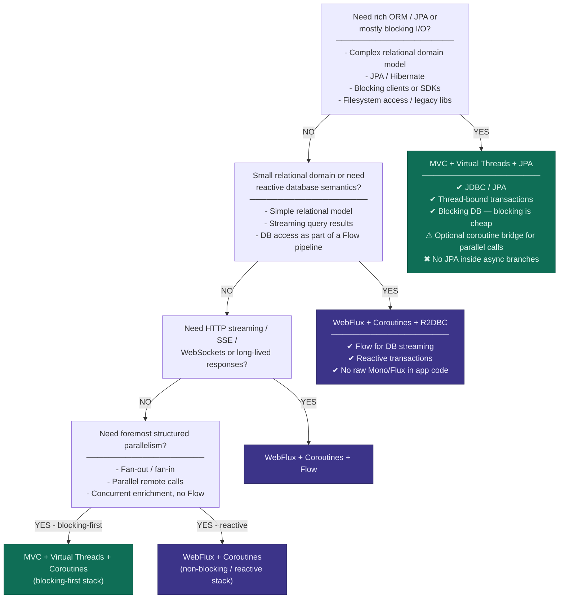

# KotlinConf2026

## Workshop
### Spring Boot With Coroutines and Virtual Threads

* [Summary](workshop/COURSE_SUMMARY.md)
* [Slides](workshop/Reactive%20Spring%20Boot%20With%20Coroutines%20and%20Virtual%20Threads%20-%20KotlinConf%202026.pdf)
* [Sources](workshop/kotlin-training-labs.zip)

*Decision Tree: When to use which Spring Boot Stack*

## Sessions

### Opening Keynote

### Bootiful Kotlin
Speaker: _Josh Long_ - Spring Developer Advocate

Spring Boot marries Spring's flexibility with conventional, common sense defaults to make application development on the JVM not just fly, but pleasant!

The framework is as clean as it gets, wouldn't it be nice if the language with which you wielded it matched its elegance?

Kotlin, the productivity-focused language from our friends at JetBrains, takes up the productivity slack to make the experience leaner, cleaner and even more pleasant.

The Spring and Kotlin teams have worked hard to make sure that Kotlin and Spring Boot are a first-class experience for all developers trying to get to production, faster and safer.

Come for the Spring and stay for the Bootiful Kotlin.

### Concurrency Patterns for Modern High Performance Kotlin Servers
Speaker: _Bowen Feng_ - Software Engineer @Google

Kotlin coroutines give us powerful tools for asynchronous server programming, but using them well requires more than knowing launch, async, or Flow in isolation. High-performance servers are built from recurring concurrency patterns: small, composable ways to structure work, stream results, isolate slow dependencies, and control producer-consumer boundaries.

In this session, we will explore several useful concurrency patterns by building a simplified AI assistant server live. We will break complex server behavior into distinct concurrency challenges and show how Kotlin’s async primitives provide elegant, structured answers: generator-style flows for more responsive event streams, fan-in for concurrent execution, sequence numbers for handling out-of-order responses, coarse and fine-grained timeouts for reliability, request hedging to improve tail latency, and backpressure and buffering for slow clients.

The demo is intentionally small, but it mirrors real server-side problems: many independent async operations, variable dependency latency, partial responses, cancellation, and streaming output. By the end, you will have a practical mental model for composing coroutines, structured concurrency, channels, and Flow into clear, reusable concurrency building blocks for Kotlin servers.

### Why Most AI Agents Never Scale? Building Enterprise-Ready AI with Koog
Speaker: _Vadim Briliantov_ - JetBrains, Koog, Technical Lead

AI agents are everywhere — but most of them break the moment you try to use them for anything real. Token costs explode, behavior becomes unpredictable, and primitive “LLM + loop” architectures simply don’t scale beyond flashy demos.

At JetBrains, we’ve been building agents that power real products used by millions. Koog is the open-source Kotlin and JVM framework that came out of this experience and was released at the KotlinConf 2025 exactly 1 year ago. In this talk, we’ll introduce Koog 1.0.0-RC and show how its design makes AI agents scalable, predictable, and ready for production.

Koog gives Kotlin and Java teams a complete toolset for building agents as well-structured, type-safe systems — whether you’re using simple functional agents, graph strategies, or planning-based approaches. It integrates deeply with the JVM and Kotlin Multiplatform ecosystems, including Spring, Spring AI, Ktor, Langfuse, W&B Weave, AWS Agent Core, Google Agent Engine, and full support for Android and Gemma-based local agents.

We’ll also look at how Koog handles challenges that most agent frameworks avoid:

* Managing cost and context at scale through strategy-driven decomposition.
* Modeling domain behavior using strongly-typed steps, so agents produce reliable, controlled outputs instead of guesswork.
* Persisting and checkpointing agent state for fault recovery and long-running workflows.
* Observing, evaluating, and improving agents with OpenTelemetry, Langfuse, and W&B Weave.
* By the end, you’ll understand why most AI agents don’t scale and how Koog helps you build the ones that do: agents that run across JVM and KMP targets, integrate cleanly with existing systems, and remain robust under real-world load.

If you want to bring AI agents into production without rewriting your stack or sacrificing reliability, this talk is for you.

### The Lord of Collection Functions - The Fellowship of Kotlin

Speaker: _Ben Kadel_- Android / Mobile Platform Engineer

A darkness has awoken in Center-earth, an ancient evil is reaching out of the shadows of every corrupt codebase, intent on bringing destruction & algorithmic oppression to all that call this world home. Everything that once was cherished will be lost, if the growing scourge is not defeated & cast back into the fires from whence it came…

That my dear friends, is where you come in…

Join the Kotlin fellowship on an exciting journey to save Center-earth from the imperative evil that was thought long extinct, but is now looping back once more! Help restore pure functional programming to this peaceful realm, ensure immutability & defeat the evil Dark Lord For-ron.

Together, we will explore the expansive array of Kotlin Collection Functions; these allow us to perform useful tasks on collections, like Set, Map, & List. Enabling us to transform, check, analyse, & aggregate the contents of the collection. We will unlock their secrets—understanding where to wield them, and how to apply their power for maximum effect, including (but not limited to):

filter, map & partition.

flatMap, zip & groupBy.

associateWith, windowed & runningFold.

